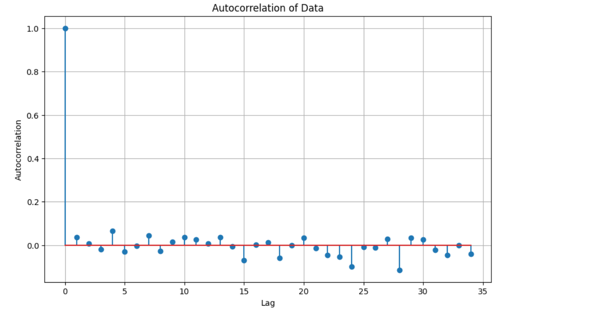

# Ex.No: 03   COMPUTE THE AUTO FUNCTION(ACF)
Date: 

### AIM:
To Compute the AutoCorrelation Function (ACF) of the data for the first 35 lags to determine the model
type to fit the data.
### ALGORITHM:
1. Import the necessary packages
2. Find the mean, variance and then implement normalization for the data.
3. Implement the correlation using necessary logic and obtain the results
4. Store the results in an array
5. Represent the result in graphical representation as given below.
### PROGRAM:
```
import matplotlib.pyplot as plt
import numpy as np
data = [3, 16, 156, 47, 246, 176, 233, 140, 130, 101, 166, 201, 200, 116, 118, 247, 209, 52, 153, 232, 128, 27, 192, 168, 208, 187, 228, 86, 30, 151, 18, 254, 76, 112, 67, 244, 179, 150, 89, 49, 83, 147, 90, 33, 6, 158, 80, 35, 186, 127]
lags = range(35)
autocorr_values = []
mean_data = np.mean(data)
variance_data = np.var(data)
normalized_data = (data - mean_data) / np.sqrt(variance_data)
for lag in lags:
  if lag == 0:
    autocorr_values.append(1)
  else:
    auto_cov = np.sum((data[:-lag] - mean_data) * (data[lag:] - mean_data)) / 100
    autocorr_values.append(auto_cov / variance_data)  
plt.figure(figsize=(10, 6))
plt.stem(lags, autocorr_values)
plt.title('Autocorrelation of Data')
plt.xlabel('Lag')
plt.ylabel('Autocorrelation')
plt.grid(True)
plt.show()
```

### OUTPUT:

### RESULT:
        Thus we have successfully implemented the auto correlation function in python.
